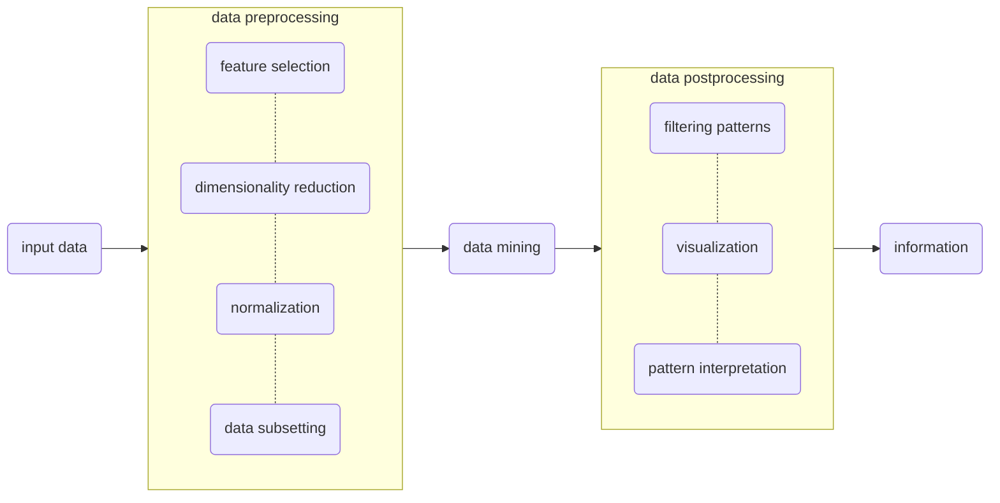

#  introduction

|  **[homepage](./README.md)** |    |
|:-----------------------------|:---|
| **course** | introduction to data mining |
| **date**   | august 21 2023 | 
| **covers** | what is the challenge and why should we do data mining.  what is data mining:  definition, process, and examples.  data mining tasks:  classification, clustering, association rules, anomaly detection |

##  table of contents

1.  [introduction](#introduction)
2.  [what is data mining?](#what-is-data-mining)
3.  [motivating challenges](#motivating-challenges)
4.  [origins of data mining](#origins-of-data-mining)
4.  [data mining tasks](#data-mining-tasks)

###  introduction

> Rapid advances in data collection and storage technology, coupled with the ease with which data can be generated and disseminated, have triggered the explosive growth of data, leading to the current age of big data. Deriving actionable insights from these large data sets is increasingly important in decision making across almost all areas of society, including business and industry; science and engineering; medicine and biotechnology; and government and individuals. However, the amount of data (volume), its complexity (variety), and the rate at which it is being collected and processed (velocity) have simply become too great for humans to analyze unaided. Thus, there is a great need for automated tools for extracting useful information from the big data despite the challenges posed by its enormity and diversity.
  Data mining blends traditional data analysis methods with sophisticated algorithms for processing this abundance of data. In this introductory chapter, we present an overview of data mining and outline the key topics to be covered in this book. We start with a description of some applications that require more advanced techniques for data analysis.

###  what is data mining?

data minig is the process of automatically dicovering useful information in large data repositories.  data mining techniques are deployed to scour large data sets in order to find novel and useful patterns that might otherwise remain unknown.  they also provide the capability to predict the outcome of a future observation, such as the amount a customer will spend at an online or a brick-and-mortar store.

not all information discovery tasks are considered to be data mining.  examples include queries, this is because such tasks can be accmplished through simple interactions with a database management system or an information retrieval system.  these systems rely on traditional computer science techniques, which include sopisticated indexing structures and query processing algorithms, for efficiently organizing and retrieving information from large data repositories.  nonetheless data mining techniques have been used to enhance the performance of such systems by improving the quality of the search results based on their relevance to the input queries.

####  the process of knowledge discovery in databases KDD

###  motivating challenges

1.  scalability
2.  high dimensionality
3.  heterogeneous and complex data
4.  data ownership and distribution
5.  non traditional analysis

